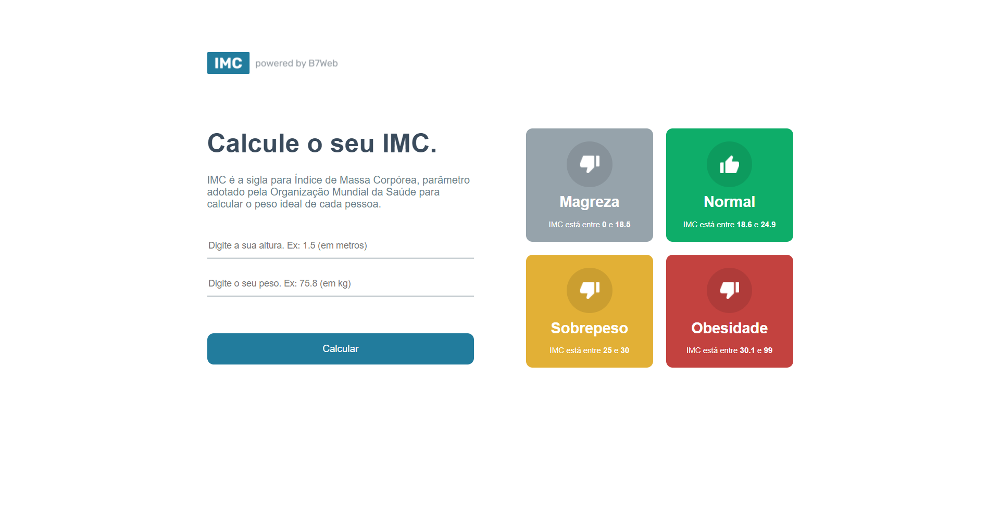
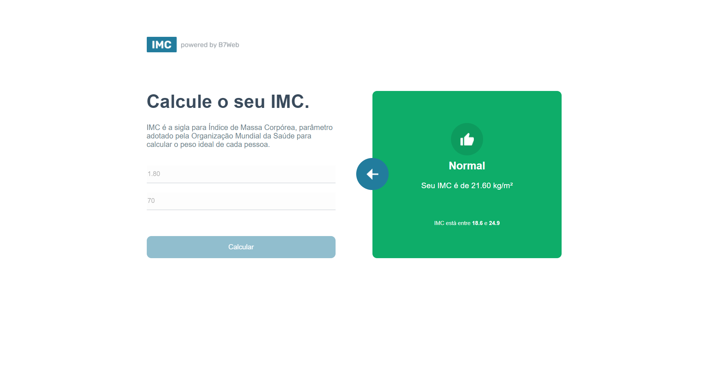

<h1 align="center">IMC Calculator - React.js + Typescript</h1>
<h1 align="center"></h1>
<h1 align="center"></h1>

<hr>

## :rocket: Technologies

The following tools were used in this project:

- [React](https://pt-br.reactjs.org/)
- [TypeScript](https://www.typescriptlang.org/)

## :white_check_mark: Requirements

Before starting :checkered_flag:, you need to have [Git](https://git-scm.com) and [Node](https://nodejs.org/en/) installed.

## :checkered_flag: Starting

```bash
# Clone this project
$ git clone https://github.com/augustodevjs/React-calculator-IMC

# Access
$ cd meuapp

# Run the project
$ npm start

# The server will initialize in the <http://localhost:3000>
```
### :airplane: See the result

https://augustodevjs.github.io/React-calculator-IMC/